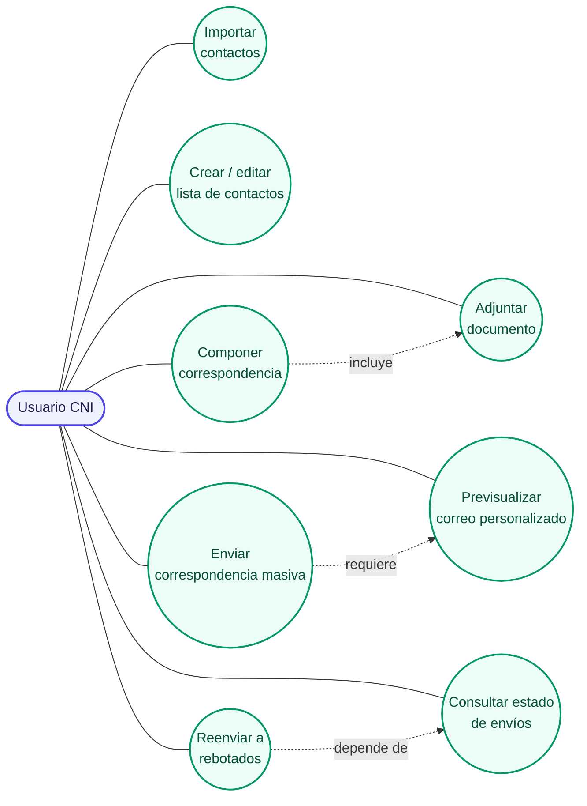
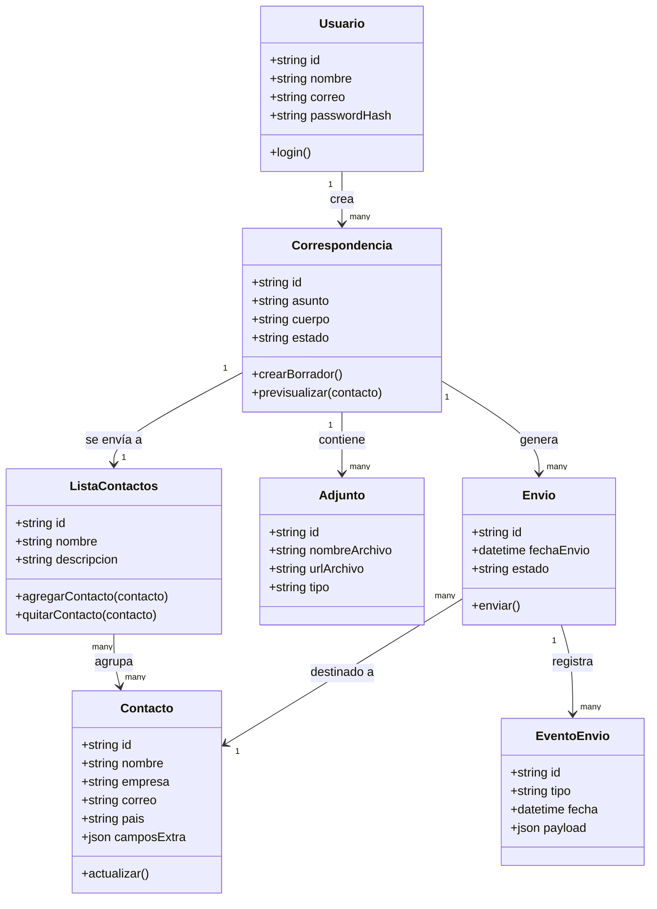
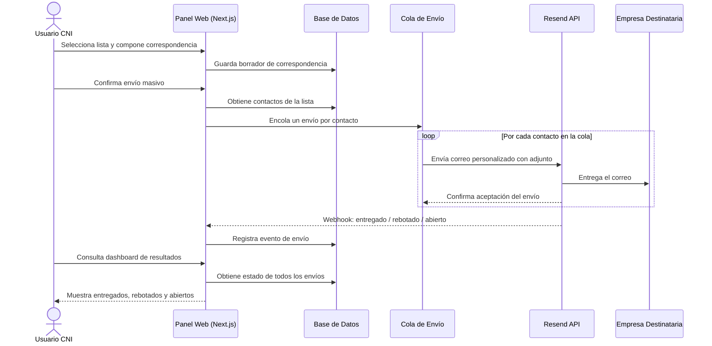
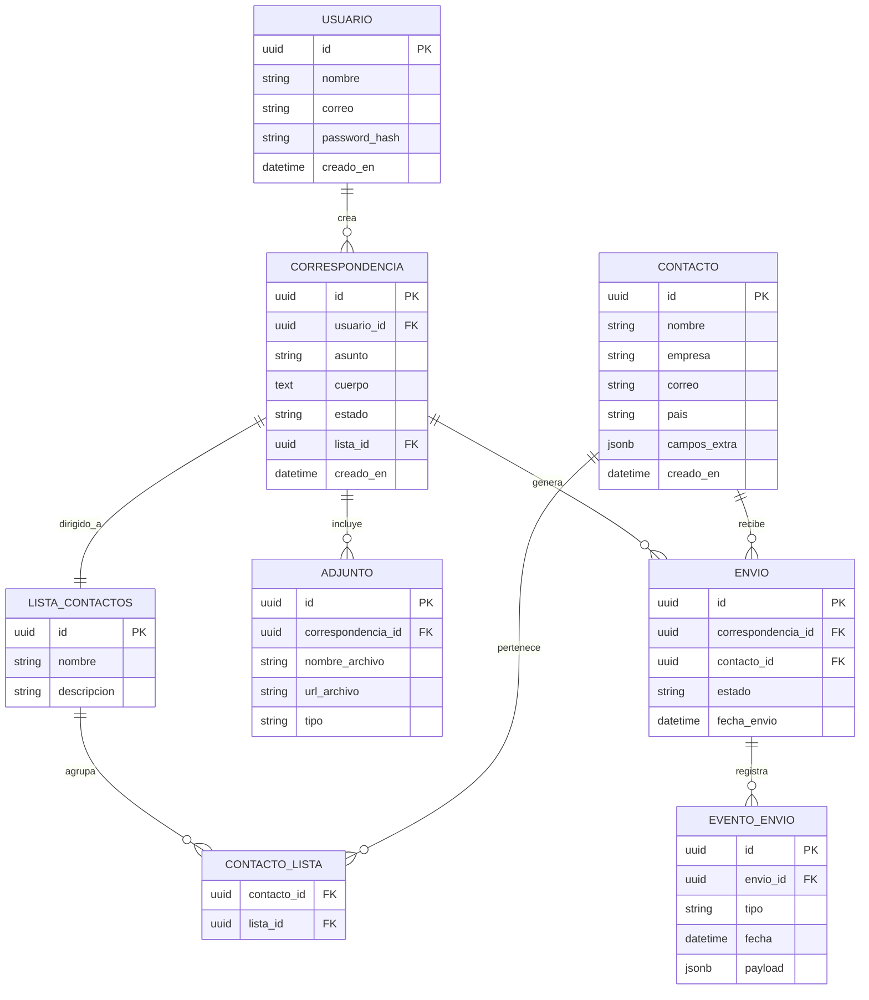
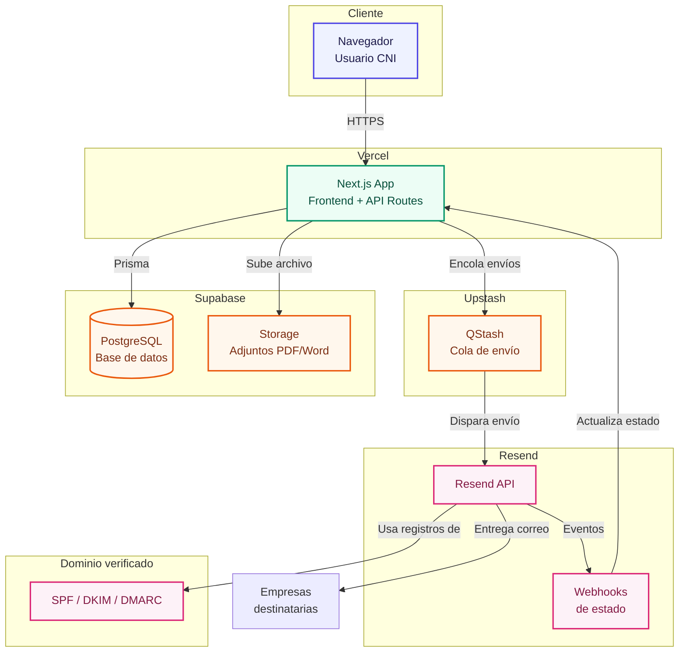

# Panel de Correspondencia CNI

Sistema interno para reemplazar el envío manual de cartas comerciales (Word + correspondencia) por un panel web que permite componer, personalizar y enviar correspondencia masiva a empresas a través de Resend, con seguimiento de entregas.

---

## 1. Descripción general

CNI (Coorporación de Negocios Interoceánicos) envía actualmente cartas comerciales (ofertas de maíz, transporte, logística) usando el módulo de correspondencia de Word combinado con listas en Excel. Este proceso es manual, no deja registro de qué empresas recibieron qué oferta, y no permite saber si el correo fue entregado o abierto.

Este proyecto reemplaza ese flujo por un **panel interno** donde el equipo de CNI puede:

- Importar y mantener una base de contactos de empresas
- Componer correspondencia (asunto, cuerpo, variables de personalización y adjuntos)
- Enviar de forma masiva a través de **Resend**
- Ver el estado de cada envío (entregado, rebotado, abierto)

---

## 2. Objetivos del proyecto

| Objetivo | Descripción |
|---|---|
| Centralizar contactos | Una sola fuente de verdad para empresas y correos, reemplazando el Excel disperso |
| Agilizar la composición | Redactar una vez y enviar a muchas empresas, sin repetir el proceso de Word |
| Personalizar sin esfuerzo | Variables tipo `{nombre}`, `{empresa}` que se reemplazan automáticamente |
| Visibilidad de resultados | Saber qué se entregó, qué rebotó y qué se abrió |
| Profesionalizar el envío | Dominio verificado (SPF/DKIM/DMARC) para evitar spam |

---

## 3. Alcance

**Incluye (fase 1):**
- Gestión de contactos y listas/segmentos
- Composición de correspondencia con variables y adjunto (PDF/Word ya generado)
- Envío masivo vía Resend con control de límites
- Registro de eventos de envío vía webhooks

**Fuera de alcance (por ahora):**
- Generación automática de PDF personalizado por destinatario (fase 2)
- Editor visual de plantillas HTML tipo boletín (fase 2)
- Respuestas entrantes / bandeja de entrada compartida

---

## 4. Stack tecnológico

| Capa | Tecnología | Motivo |
|---|---|---|
| Frontend + Backend | **Next.js 14 (App Router) + TypeScript** | Un solo proyecto, SSR, API routes, fácil despliegue |
| UI | **Tailwind CSS + shadcn/ui** | Componentes accesibles y consistentes, desarrollo rápido |
| Base de datos | **PostgreSQL (Supabase)** | Relacional, robusto, con panel de administración incluido |
| ORM | **Prisma** | Tipado seguro end-to-end con TypeScript |
| Envío de correo | **Resend + React Email** | API simple, soporte de adjuntos, webhooks de estado |
| Cola de envío | **Upstash QStash** (o cola propia con rate-limit) | Evita saturar el límite de envíos de Resend |
| Autenticación | **NextAuth (Auth.js)** | Acceso restringido solo al equipo de CNI |
| Almacenamiento de adjuntos | **Supabase Storage** | Guardar PDFs/Word subidos antes de enviarlos |
| Validación | **Zod** | Validación de formularios y payloads de API |
| Hosting | **Vercel** (app) + **Supabase** (DB/Storage) | Despliegue continuo, escalabilidad, bajo mantenimiento |

---

## 5. Casos de uso

**Actor principal:** Usuario del equipo de CNI (rol único por ahora, ampliable a roles después)



### Descripción de casos de uso clave

| Caso de uso | Precondición | Resultado |
|---|---|---|
| Importar contactos | Archivo CSV/Excel con columnas nombre, empresa, correo | Contactos creados o actualizados en la base de datos |
| Componer correspondencia | Al menos una lista de contactos existente | Borrador de correspondencia guardado |
| Enviar correspondencia masiva | Correspondencia con asunto, cuerpo y lista seleccionada | Correos encolados y enviados vía Resend |
| Consultar estado de envíos | Al menos un envío realizado | Vista con entregados, rebotados y abiertos por envío |

---

## 6. Diagrama de clases (modelo de dominio)



---

## 7. Diagrama de secuencia (flujo de envío masivo)



---

## 8. Diagrama entidad-relación



---

## 9. Diagrama de despliegue



---

## 10. Estructura de carpetas propuesta

```
panel-correspondencia-cni/
├── app/
│   ├── (auth)/
│   │   └── login/
│   ├── contactos/
│   ├── correspondencia/
│   │   ├── nueva/
│   │   └── [id]/
│   ├── envios/
│   └── api/
│       ├── contactos/
│       ├── correspondencia/
│       ├── envios/
│       └── webhooks/resend/
├── components/
├── lib/
│   ├── resend.ts
│   ├── prisma.ts
│   └── queue.ts
├── prisma/
│   └── schema.prisma
└── emails/
    └── plantilla-correspondencia.tsx
```

---

## 11. Variables de entorno

```
DATABASE_URL=
RESEND_API_KEY=
RESEND_WEBHOOK_SECRET=
NEXTAUTH_SECRET=
NEXTAUTH_URL=
SUPABASE_URL=
SUPABASE_SERVICE_ROLE_KEY=
QSTASH_TOKEN=
```

---

## 12. Roadmap por fases

| Fase | Contenido |
|---|---|
| **Fase 1 (MVP)** | Contactos, listas, composición con adjunto manual, envío vía Resend, webhook básico |
| **Fase 2** | Generación automática de PDF/Word personalizado por destinatario |
| **Fase 3** | Plantillas HTML tipo boletín, editor visual |
| **Fase 4** | Roles de usuario, historial avanzado, reenvío automático a rebotados |

---

## 13. Consideraciones de seguridad

- Acceso al panel restringido por autenticación (solo equipo CNI)
- Verificación de dominio (SPF/DKIM/DMARC) antes de enviar en producción
- Validación de archivos adjuntos (tipo y tamaño) antes de subir a Storage
- Rate-limiting en el envío para respetar límites de Resend y evitar marcarse como spam
- Registro de auditoría de quién envió qué correspondencia y cuándo
